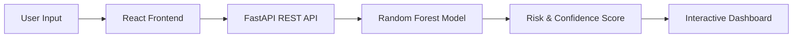

# 🫀 CardioAI: Heart Disease Risk Predictor


> **AI-powered cardiovascular risk analysis at your fingertips.** Leveraging Machine Learning to provide fast, precise, and secure heart disease risk assessments.

---

## 🎯 Project Overview

CardioAI is an end-to-end healthcare web application designed to predict the probability of heart disease in patients. By analyzing **13 core clinical parameters**, the system provides a comprehensive risk assessment (Low, Moderate, or High) backed by a production-grade Random Forest model. 

The application is built for performance, security, and exceptional user experience, featuring a modern **Glassmorphism UI** with full **Dark Mode** support and interactive data visualizations.

---

## ✨ Features

- 🧠 **Real-time ML Inference**: Instant risk assessment powered by a Scikit-learn Random Forest model.
- 🎨 **Modern Glassmorphism UI**: A high-end, translucent interface with depth and aesthetic red gradients.
- 🌓 **Dynamic Dark Mode**: Full system availability in both light and dark themes with smooth transitions.
- 🖱️ **Interactive UX**: "Section Glow" effects that respond to cursor movement for enhanced focus.
- 🏥 **Clinical Intelligence**: Analysis of 13 critical medical features including Age, Cholesterol, Blood Pressure, and Chest Pain patterns.
- 💓 **Animated Diagnostics**: Custom heart-scanning loader that provides visual feedback during model processing.
- 📊 **Feature Analysis Matrix**: SHAP-style visualizations explaining the impact of specific parameters on the prediction.
- 📱 **Fully Responsive**: Optimized for seamless use across desktop, tablet, and mobile devices.

---

## 🎨 UI/UX Highlights

- **Design System**: Built using a custom glassmorphism aesthetic with translucent panels (`backdrop-blur`) and thin borders for a medical-grade "clean" look.
- **Micro-interactions**: Subtle pulse and scan animations on the landing and loading screens to reduce perceived wait time.
- **Cognitive Load Optimization**: Step-based navigation (Landing → Input Form → Analysis → Result) to keep the user focused.
- **Visual Feedback**: Real-time validation and hover-glow effects on data input sections.

---

## 🛠️ Tech Stack

### Frontend
- **Framework**: React.js (Vite)
- **Styling**: Tailwind CSS
- **Icons**: Lucide React
- **Charts**: Recharts (for SHAP-style analysis)
- **Animation**: Native CSS Keyframes + Tailwind Utilities

### Backend
- **Framework**: FastAPI (High-performance Python API)
- **Runtime**: Uvicorn
- **Documentation**: Swagger UI (Auto-generated)

### Machine Learning
- **Algorithm**: Random Forest Classifier
- **Preprocessing**: Pandas, NumPy
- **Framework**: Scikit-Learn
- **Serialization**: Joblib

---

## 🏗️ Project Architecture



1. **User** enters clinical data into the React UI.
2. **FastAPI** validation checks the diagnostic parameters.
3. **ML Model** processes features through the trained Random Forest ensemble.
4. **API Response** returns probability scores and risk classifications.
5. **UI Visualization** renders a SHAP-style feature importance matrix and gauge.

---

## 📂 Folder Structure

```text
.
├── app.py                  # FastAPI Entry Point
├── train.py                # ML Training Script
├── requirements.txt        # Backend Dependencies
├── heart_disease_model.pkl # Trained Weights
├── heart.csv               # Dataset
├── frontend/               # React Project
│   ├── src/
│   │   ├── App.jsx         # Main Logic & UI
│   │   ├── index.css       # Custom Glassmorphism Styles
│   │   └── main.jsx        # Entry Point
│   ├── tailwind.config.js  # Dark Mode & Theme Config
│   └── package.json        # Frontend Dependencies
└── README.md
```

---

## 🚀 Installation & Setup

### 1. Backend Setup
```bash
# Clone the repository
git clone https://github.com/yourusername/heart-disease-predictor.git
cd heart-disease-predictor

# Install dependencies
pip install -r requirements.txt

# Run the API
python app.py
```
*API will be available at `http://localhost:8000`*

### 2. Frontend Setup
```bash
cd frontend

# Install dependencies
npm install

# Run the dev server
npm run dev

# Or build for production
npm run build
```

---

## 🔌 API Documentation

### POST `/predict`
Submit patient clinical data for analysis.

**Request Body:**
```json
{
  "age": 52,
  "sex": 1,
  "cp": 0,
  "trestbps": 125,
  "chol": 212,
  "fbs": 0,
  "restecg": 1,
  "thalach": 168,
  "exang": 0,
  "oldpeak": 1.0,
  "slope": 2,
  "ca": 2,
  "thal": 3
}
```

**Response Body:**
```json
{
  "probability": 0.82,
  "risk_level": "High"
}
```

---

## 🔮 Future Improvements
- [ ] **Explainability**: Integrate actual SHAP values for clinical-level explainable AI.
- [ ] **Data Export**: Generate downloadable PDF medical reports.
- [ ] **Security**: Implementation of OAuth2 authentication for patient data protection.
- [ ] **Deployment**: One-click deployment script for AWS/Heroku/Vercel.

---

## 🏥 Use Cases
- **Early Detection**: Assisting individuals in identifying potential risks early.
- **Medical Education**: Demonstrating how clinical factors influence cardiovascular health probabilities.
- **Healthcare Awareness**: Promoting consistent monitoring of blood pressure and cholesterol.

---

## 💡 Learning Outcomes
- **Full-stack Orchestration**: Connecting a high-performance Python backend with a modern React frontend.
- **Model Deployment**: Moving from a Jupyter Notebook research environment to a production REST API.
- **UX for AI**: Designing interfaces that make machine learning predictions intuitive and non-threatening.

---

## 👨‍💻 Author
## 👨‍💻 Author
**Bensun**  


---
*Disclaimer: This tool is for educational purposes only and should not be used as a replacement for professional medical advice.*
